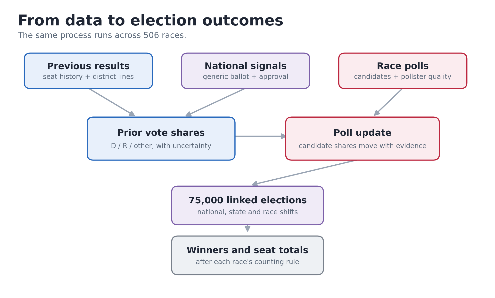
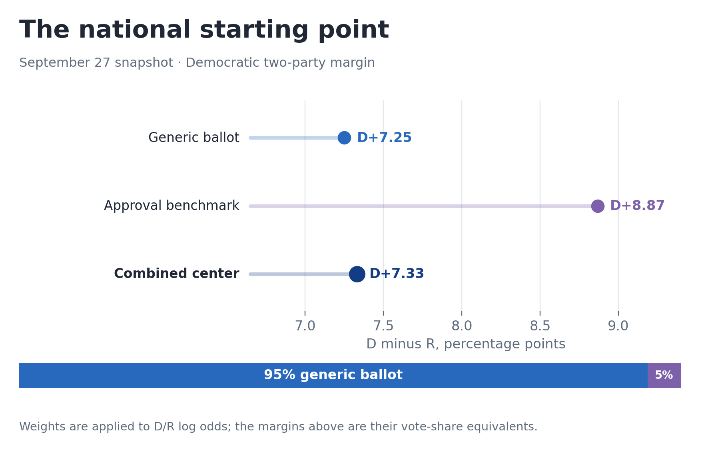
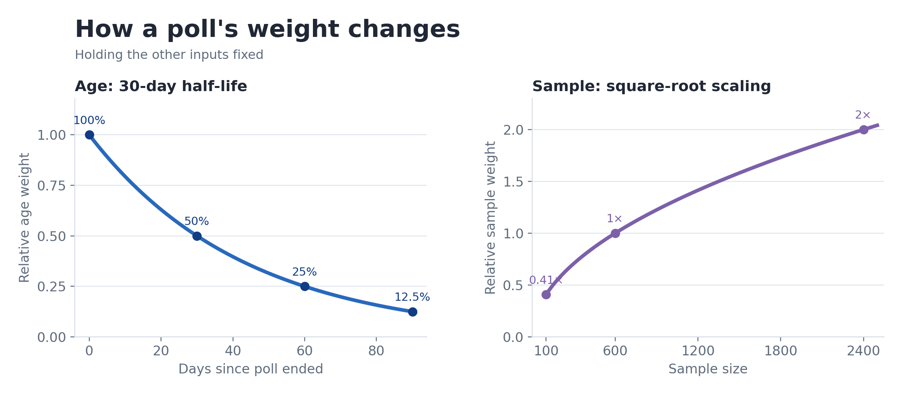
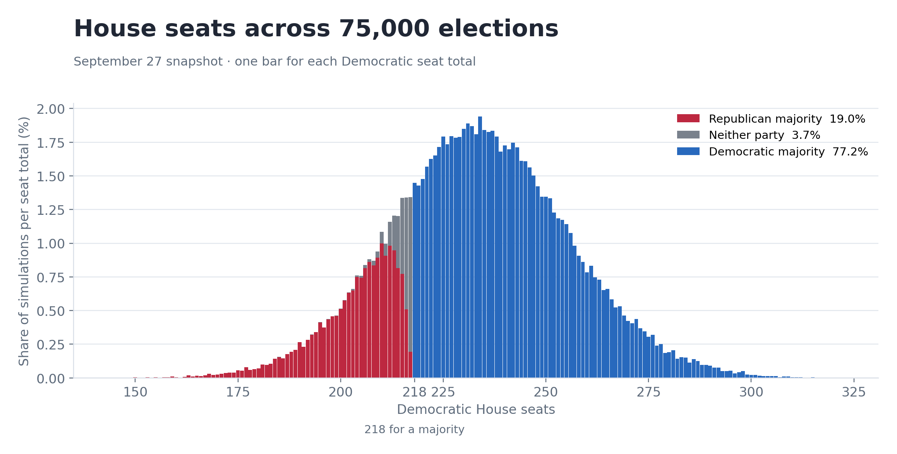

# Trying to predict the unpredictable, again.

**[See the live 2026 election model →](https://elections.sahilshukla.ca/us2026)**

<!-- Draft for Medium. Numbers in this article describe the model snapshot cut off at September 27, 2026, 02:11 UTC. Check them against the live forecast before publication. -->

Two years ago, I wrote [an article about my 2024 election model](https://medium.com/@sshuklaa/how-do-you-predict-the-unpredictable-an-electoral-simulation-model-for-the-2024-election-182279531246). A lot of it was spent defending the decisions I made about the polls. Some of those decisions were reasonable, and others were a result of not having quite enough time to get everything right. This year, my goal is to hopefully make decisions which make a little more sense.

I also have a much bigger problem now. The model covers 435 House districts, 35 Senate races, and 36 governor races, and unlike the general election, I have to actually trust my models work when it outputs a result for a random house race I have no priors for.

So even though I might be wrong (maybe even more than last time), here are some of my choices.

*The short version of the model.*

## 1. What would I think without a single 2026 poll?

I need an answer to that question before adding current polling. Otherwise an unpolled House district would have no forecast, and a Senate race with one survey could be determined almost entirely by that survey.

I start with the last comparable result: usually the 2024 House race for a district, the same Senate seat six years ago, or the last governor election in the state. The biggest problem with thisis that previous results are sometimes really bad at giving any useful info about the future: candidates change, district lines change, and sometimes neither party fields a candidate (stupidly annoying). The model has a bunch of separate rules for those cases, in lieu of actually modelling how people shift in those scenarios (both basically signal the same thing in the end).

To make this manageable, I put votes into three groups: Democratic (D), Republican (R), and other (O). The third group includes independents and minor parties. I then work with two log ratios:

> u = log(D / R)  
> v = log((D + R) / O)

The first is the balance between the major parties. The second is how much vote goes to everyone else. Log ratios let the model move a race around without either falling below 0. 

I fit how these ratios changed between previous and subsequent elections using historical House, Senate, and governor results. The model also estimates how much those transitions vary. This gives each race a *distribution* of possible vote shares before its 2026 polls enter, rather than one supposedly correct number.

There is some local information beyond the last result. For the Senate, I estimate the state's Senate lean relative to the national House vote using previous results for that seat, the state's presidential vote, and whether a candidate is returning. Governors get a separate fit using previous governor and presidential results. In the House, changes to district boundaries can shift the starting point. After setting up the initial weights, I spent a good amount of time fitting them to previous results instead of the pure guesswork I did last cycle.

I also split the uncertainty into national, office, state, and race components. If a simulation gives Democrats a surprisingly good night nationally, many races move together. If it gives one state a strange result, several races in that state can move together too. This really just prevents weird results where a race further down the tipping point scale doesnt flip either way before a race less partisan than it.

## 2. What is happening nationally?

The generic ballot is my main measure of current national support. It asks which party people would vote for in a congressional election. I use the 2026 polling collected by [The New York Times](https://www.nytimes.com/newsgraphics/polls/), with more weight on recent polls, larger samples, and stronger pollsters.

I also built a historical benchmark from 39 House elections between 1948 and 2024. It uses the previous House vote, the president's party, whether the election is a midterm, and presidential approval to estimate the national House vote. I then selected its regularization by testing it on later election cycles.

Here is the catch. That historical model was trained to predict the *eventual* House vote. The generic ballot measures what respondents say *now*. Since this is a nowcast, I give the generic ballot 95% of the weight in the national center and the approval model 5%, combining them in Democratic/Republican log odds.

For example, atthe September 27 cutoff, the weighted generic ballot was about **D+7.25**. The approval-based benchmark was about **D+8.87**. Their combination was about **D+7.33**.

*The 95/5 blend is done in D/R log odds. The figure translates it back into vote-margin points.*

Why 95/5? Because I wanted approval to have a modest say without overpowering a substantial amount of current generic-ballot polling. Its important to note that this is simply a choice I made without a huge amount of testing, but it sort of feels intuitively correct that the two numbers aren't perfectly correlated.

I also chose not to ingest consumer sentiment, gas prices, or opinions on the (very very unpopular!) Iran war. My opinion is that a person with negative sentiment about any of those makes their choice clear on the generic ballot, and so introducing them would clutter the other inputs.

## 3. How much should I believe a poll?

For each Senate, House, and governor race, I match poll answers to the candidates actually on that ballot. A question showing one candidate at 48% and another at 44% gives the model a log ratio of log(48/44). Doing this by candidate matters when the ballot has three credible names instead of a convenient D and R.

The weight for a poll is roughly:

> weight = 2^(−days old / 30) × √(max(sample size, 100) / 600) × pollster quality

So an otherwise identical poll loses half its age weight after 30 days. A sample of 2,400 gets twice the sample-size weight of a sample of 600, rather than four times. 

*These curves hold pollster quality and the other weight component fixed.*

For pollster quality, I steal [Nate Silver's January 2026 ratings](https://www.natesilver.net/p/pollster-ratings-silver-bulletin) where I can match the pollster, then use the older 538 (RIP) ratings as a fallback. An unrated poll gets neutral weight, mostly due to the fact that they seem to not all be terrible, most of them are just really local.

The actual update is a multivariate version of a fairly simple idea: a poll should move a race more if the poll is informative or the pre-poll estimate was uncertain. Historical poll errors supply a noise floor, so collecting ten similar polls does not make a race ten times as certain. The candidate shares are updated together, which is why a poll with an independent can move all three candidates without being squeezed into a two-party margin. If a poll leaves an independent out, the model keeps that candidate's prior share in the calculation.

This was particularly important for the unusual Senate ballots. If one of the major parties is absent, the ordinary D/R model has very little to say about the independent. I use historical races with a similar ballot structure and widen the prior uncertainty. If the polls strongly disagree with that prior, the model can widen it further and give those polls more room to move the race. 

Some races still have no usable polls. Their estimates rely much more heavily on the historical starting point and its uncertainty. There is no way around that other than getting better data (which I do not have the means or want to collect lol).

## 4. Why simulate the whole election?

After updating the candidate vote shares, I draw 75,000 possible elections. Each draw uses the same national, office, and state shocks across the relevant races. I then apply each race's actual counting rule, including runoffs and ranked-choice voting where they matter.

This is how a 52% chance for a candidate should be read: they won about 52% of the simulated elections. It does not mean that they will receive 52% of the vote. The House and Senate seat distributions on the website come from adding the winners within each of those same 75,000 elections.

*The September 27 House simulation. The grey sliver consists of outcomes where neither party reaches 218.*

Senate control takes one more step. The site's majority gauge uses the case where other-party winners caucus with Democrats, mostly due to the fact that every major independant is running as the de facto left-of-Republican candidate.

## 5. Did it work on old elections?

I replayed historical elections using polling available at earlier cutoffs and checked the simulated results against certified outcomes. Where possible, I selected model features by testing on entire later election cycles.

There are results I like and results I do not. For instance, the seven-day 2020 House replay put the Democrats at about 244 seats, with a 95% interval of 226 to 260. They won 222. 

There is also a limit to what this exercise can establish. We know who won in November 2020. We do not know who *would have* won had everyone voted seven days earlier. That comparison mixes polling error with whatever changed during the intervening week. The same problem is larger when the cutoff is months before Election Day. So I use historical results to find obvious failures and to estimate uncertainty, but obviously take everything with a grain of salt, I am not Nate Cohn or Nate Silver.

The present model has other choices with limited evidence: the 95/5 national blend, the 30-day poll half-life, and how to handle a rare ballot with a serious independent. These features are really important for me to conclude, but my statistical chops aren't quite where they need to be for me to say they are important.

## And that's the model!

Or at least the parts that matter most to understanding the numbers on the website. There are plenty of unglamorous details involving candidate names, district boundaries, and election rules; those matter too, especially when one wrong candidate can turn a sensible forecast into a very strange map (at one point in development Dem's were winning OK).

I will keep updating the [live forecast](https://elections.sahilshukla.ca/) as new information arrives. The date slider preserves the previous versions, so you can see when the model changed its mind.

Thanks!

Sahil Shukla
